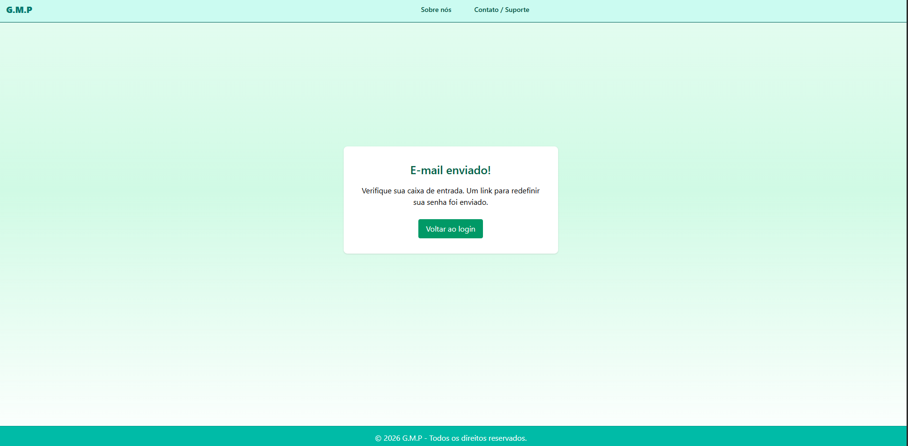
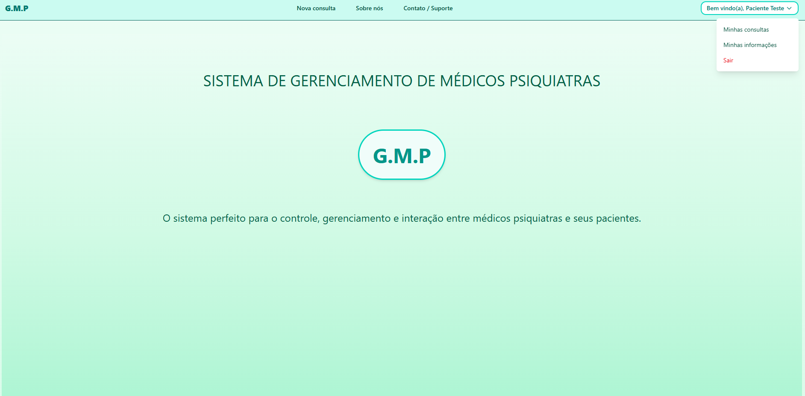
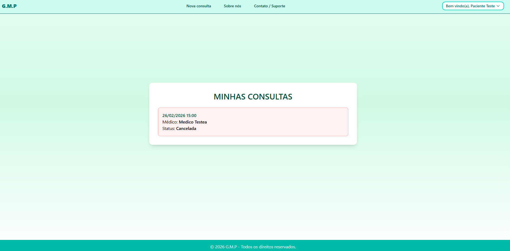
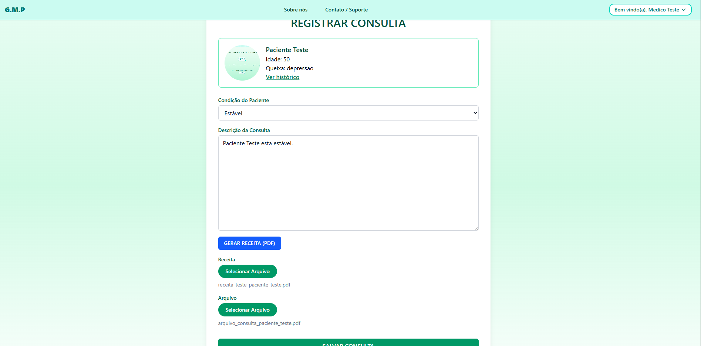
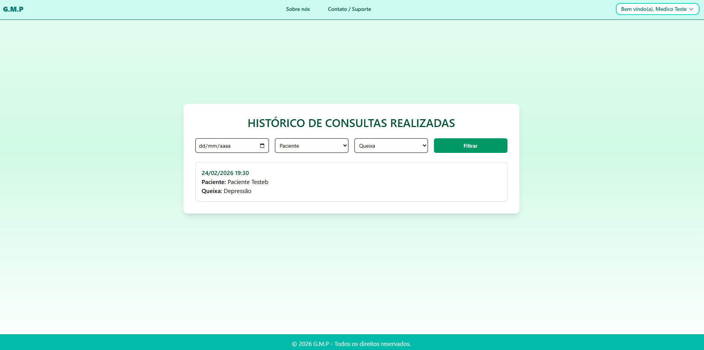
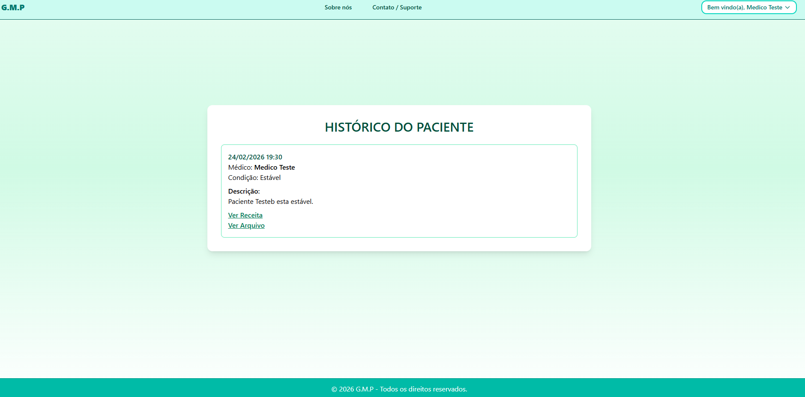

# GMP


> **Nota:** O nome utilizado é meramente fictício e tem apenas finalidade demonstrativa.

Sistema fullstack para gestão de consultas psiquiátricas, com controle de permissões baseado em roles, regras de negócio implementadas em camada de services e API REST autenticada.

## Instalação

```bash
git clone https://github.com/RaphaelReggiani/app_psiquiatria
cd gmp
python -m venv venv
source venv/bin/activate  # ou venv\Scripts\activate no Windows
pip install -r requirements.txt
python manage.py migrate
python manage.py runserver
```

## Estrutura do Projeto

```bash
gmp/
├── core/
│   ├── settings.py
│   └── urls.py
│
├── usuarios/
│   ├── urls.py
│   ├── models.py
│   ├── forms.py
│   ├── views.py
│   ├── pw_reset.py
│   ├── exceptions.py
│   ├── decorators.py
│   ├── constants/
│   │   ├── constants.py
│   │   └── messages_constants.py
│   └── services/
│   │    └── user_services.py
│   └── templates/...
│
├── consultas/
│   ├── urls.py
│   ├── models.py
│   ├── forms.py
│   ├── views.py
│   ├── selectors.py
│   ├── exceptions.py
│   ├── decorators.py
│   ├── constants/
│   │   ├── constants.py
│   │   └── messages_constants.py
│   └── services/
│   │    ├── cache_service.py
│   │    ├── consulta_service.py
│   │    ├── horarios_service.py
│   │    ├── log_service.py
│   │    └── receita_service.py
│   └── templates/...
│
├── api/
│   ├── urls.py
│   ├── views.py
│   ├── serializers.py
│   ├── permissions.py
│   ├── apps.py
│   └── tests/
│       ├── conftest.py
│       ├── test_agendamentos.py
│       ├── test_consultas.py
│       └── test_users.py
templates/
├── main.html
```


## Stack Utilizada

- Python 3.13.4;
- Django;
- Django REST Framework (DRF);
- MySQL;
- HTML5 + CSS3;
- Autenticação via TokenAuthentication (DRF).

## Diferenciais Técnicos

- Separação clara entre camadas (views, services, selectors);
- Regras de negócio isoladas da camada de apresentação;
- Tratamento de exceções customizadas;
- Auditoria de ações via logs persistidos;
- Geração dinâmica de documentos PDF;
- Controle de permissões no backend (não apenas no frontend).

## Arquitetura

- Separação por subapps (usuarios / consultas);
- Camada de Services para regras de negócio;
- Camada de Selectors para queries organizadas;
- Sistema centralizado de Exceptions;
- Controle de permissões baseado em Roles;
- Sistema de Logs para auditoria de ações.

## Controle de Permissões

A aplicação possui três níveis de acesso:

- Paciente;
- Médico;
- SuperADM / Staff.

Cada role possui restrições específicas controladas no backend.

## Principais Regras de Negócio

- Impedimento de agendamento duplicado;
- Antecedência mínima para cancelamento;
- Bloqueio de ações não permitidas por role;
- Registro de quem realizou cancelamentos;
- Histórico completo de consultas;
- Geração automática de receita em PDF.

## API REST

- Endpoints protegidos;
- Autenticação via token;
- Controle de acesso por role;
- Serializers estruturados.

## Testes

- Testes automatizados para usuários, agendamentos e consultas;
- Organização via pytest;
- Cobertura das principais regras de negócio da API.

## Funcionalidades

GERAL

- Cadastramento de usuários, separados por roles com limitações de permissões, sendo elas: Médico, Paciente e Staff / SuperADM;
- Cadastramento de membros com role médico e staff, limitado apenas aos SuperADMs;
- Seção de cadastro e login de usuários (incluindo as devidas validações e LOGs);
- O acesso às funcionalidades do site, permitido apenas a usuários logados;
- Funcionalidade de redefinição de senha, realizada através de envio de um e-mail para a redefinição de senha, com token de autenticação;
- Seção de Sobre Nós e Contato / Suporte;
- LOGs de todas as ações realizadas na aplicação.


UX USUÁRIOS

**UX Paciente**

- Agendamento de nova consulta;
- Impedimento de duplicação de consultas ou agendamento de novas, no caso de consultas já marcadas para o paciente;
- Acesso ao perfil de usuário, para edição das informações como: nome, queixa e etc;
- Acesso às consultas futuras e histórico;
- Possibilidade de cancelamento de consulta;
- Acesso ao contato com o suporte / equipe da aplicação.

**UX Médico**

- Impedimento de agendamento de consultas para pacientes;
- Acesso ao perfil de usuário, para edição das informações como: nome, idade e etc;
- Acesso à agenda, com as consultas futuras e filtros de: Data, Pacientes, Data, Queixas e Status;
- Acesso ao histórico de consultas realizadas pelo médico, com filtros de: Data, Paciente e Queixas;
- Acesso às funcionalidades de cancelar consulta e verificação do usuário que cancelou;
- Registro das consultas realizadas com os pacientes;
- Acesso à funcionalidade de gerar receita com template da aplicação (GMP), com necessidade apenas do preenchimento dos seguintes dados: CRM e descrição da receita.

**UX SuperADM / Staff**

- Acesso e controle de todas as funcionalidades e permissões da aplicação;
- Permissão para criação de usuários com role médico e staff.


## Imagens da Aplicação


**GERAL**


### HOME PAGE - Sem login


### HOME PAGE - Sobre Nós


### HOME PAGE - Contato / Suporte


### Cadastro - Usuário Paciente


### Login de Usuários


### Redefinição de Senha


### Redefinição de Senha - Email



**PACIENTE**


### HOME PAGE - Usuário Paciente logado


### Informações do Usuário - Paciente


### Agendamento de nova consulta - Paciente


### Agendamento de nova consulta - Paciente - ERRO


### Consultas - Paciente


### Consultas - Paciente - Consulta Cancelada



**MÉDICO**


### HOME PAGE - Usuário Médico logado


### Informações do Usuário - Médico


### Agenda Médico


### Registro de Consultas - Médico


### Receita Padrão - Médico


### Histórico de Consultas - Médico


### Histórico de Consultas - Paciente - Médico View



**SUPERADM**


### Cadastro de Usuários - SUPERADM View


### Cadastro de Usuários - SUPERADM View - Role Médico

